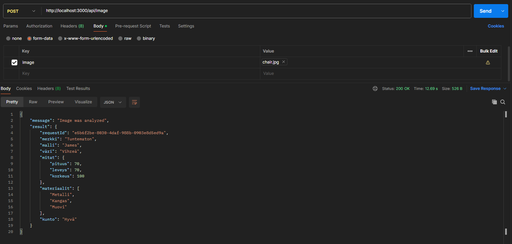
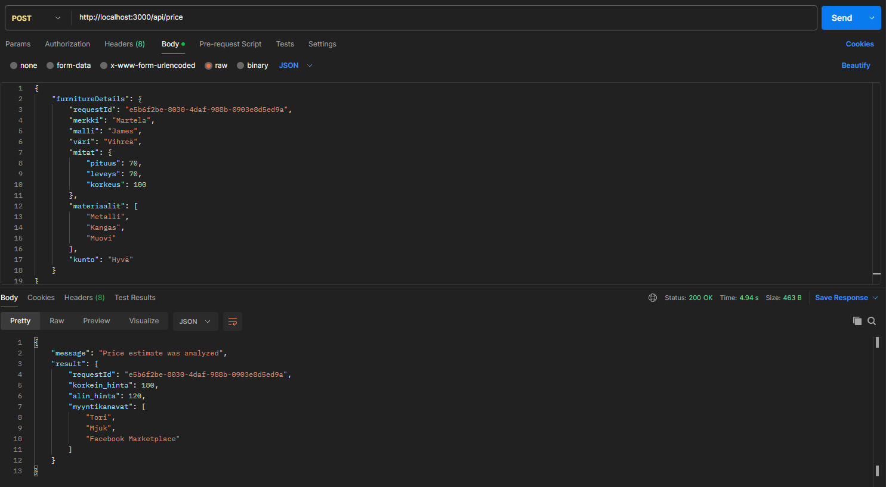
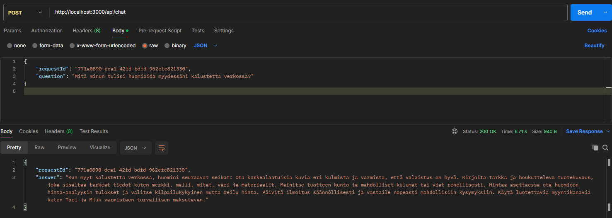
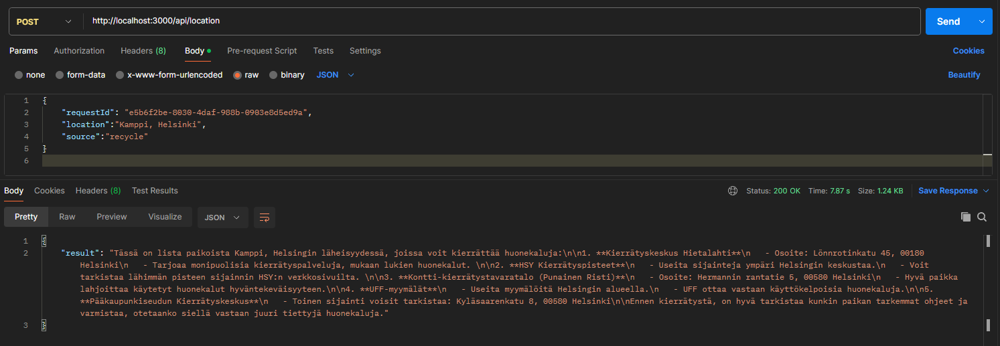
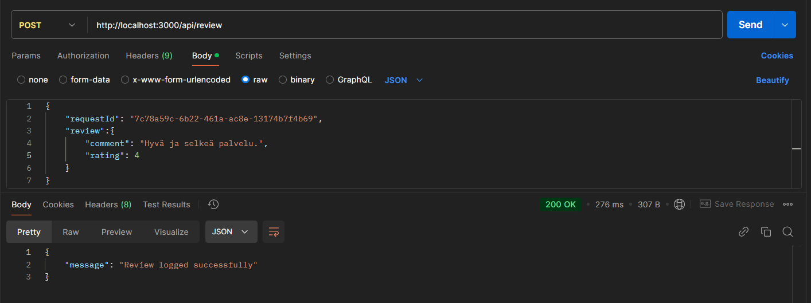
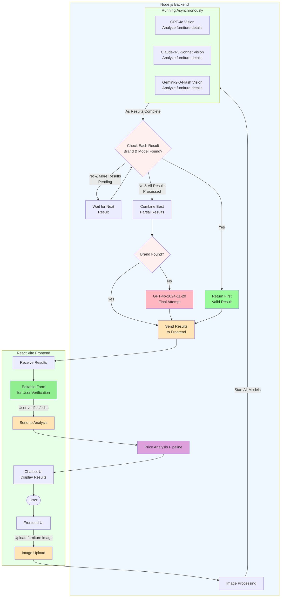
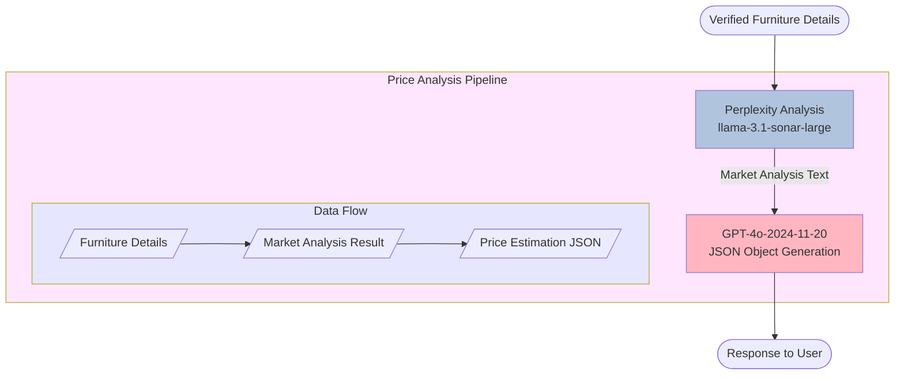

# kaluste-backend

⚠️ **WARNING: This documentation is outdated and corresponds to git TAG v1.0. The codebase has evolved significantly since this version. Please refer to the latest code for current implementation details.**

Älyä-hankkeessa KalusteArvio-projektin palvelin ja tekoälyliittymät

## Table of Contents

- [Technologies](#technologies)
- [Installation](#installation)
- [API Documentation](#api-documentation)
- [Docker Instructions](#docker-instructions)
- [Cache](#cache)
- [Database](#database)

## Technologies

- TypeScript
- Node.js
- Express.js
- OpenAI API
- MongoDB
- Docker
- Memcached

## Installation

### Enviromental variables

Create an .env file in the root folder with the following values (use the .env.template file for reference):

- OPENAI_API_KEY
- MONGODB_URI
- RAHTI_URL
- LOCAL_URL
- PORT
- MEMCACHED_HOST
- MEMCACHED_PORT

### Initialize server

```
npm run i
```

#### Run in development mode

```
npm run dev
```

#### Run in production mode

```
npm run build
npm run start
```

## API Documentation

### Roadmap

1. Send the image to /api/image 🠊 2. If the properties of the received result object have incorrect values, fix them. Send the furnitureDetails object to /api/price 🠊 3. Make a request to /api/location 🠊 4. Send all further user chat questions to /api/chat 🠊 5. After the converstation is done, send a user review to /api/review

### Route details

| HTTP | Route | Description                                      |
| ---- | ----- | ------------------------------------------------ |
| GET  | /ping | Send a request to validate the server is running |

| HTTP | Route      | Description                                                                                                                                                  |
| ---- | ---------- | ------------------------------------------------------------------------------------------------------------------------------------------------------------ |
| POST | /api/image | Send an image in raw binary format using HTML multipart/form-data. Key must be "image" and the image itself as value to recieve an analysis of the furniture |

| HTTP | Route      | Description                                                           |
| ---- | ---------- | --------------------------------------------------------------------- |
| POST | /api/price | Send furniture details in the request body to receive price estimates |

| HTTP | Route     | Description                                                                                                   |
| ---- | --------- | ------------------------------------------------------------------------------------------------------------- |
| POST | /api/chat | Send an open question regarding the piece of furniture and the AI will answer it to the best of its abilities |

| HTTP | Route         | Description                                                                                                                                                                                    |
| ---- | ------------- | ---------------------------------------------------------------------------------------------------------------------------------------------------------------------------------------------- |
| POST | /api/location | Send the user location and a single source, either "donation" or "recycle" or "repair", and the AI will find locations where the user can perform the given activity to the piece of furniture |

| HTTP | Route       | Description                                                                                                                                                |
| ---- | ----------- | ---------------------------------------------------------------------------------------------------------------------------------------------------------- |
| POST | /api/review | Send a review that includes a rating (between 1 and 5) and an optional comment. Prior to using this route, you must have sent a request to the `/api/chat` |

### Requests and Responses

> #### /api/image
>
> 

> #### /api/price
>
> 

> #### /api/chat
>
> 

> #### /api/location
>
> 

> #### /api/review
>
> 

## Docker Instructions

### Using Dockerfile

#### Build Docker Image

To build the Docker image, run the following command in the root directory:

```sh
docker build -t kaluste-backend .
```

#### Run Docker Container

```sh
docker run -d --name kaluste-backend -p 3000:3000 --env-file .env kaluste-backend
```

#### Stop Docker Container

To stop the Docker container, use the following command:

```sh
docker stop kaluste-backend
```

#### Remove Docker Container

To remove the Docker container, use the following command:

```sh
docker rm kaluste-backend
```

### Using Docker Compose

#### docker-compose-be-cache.yml

This file is used to set up and run both the backend and Memcached services.

To build and run the containers, use the following command:

```sh
docker-compose -f docker-compose-be-cache.yml up
```

To stop the running containers, use the following command:

```sh
docker-compose -f docker-compose-be-cache.yml down
```

#### docker-compose-local-cache.yml

This file is used to set up and run only the Memcached service. Note: Remove `MEMCACHED_HOST` from `.env` or set it to `localhost` for this to work.

To build and run the Memcached container, use the following command:

```sh
docker-compose -f docker-compose-local-cache.yml up
```

After the Memcached container is running, run the backend locally:

```sh
npm run dev
```

To stop the running Memcached container, use the following command:

```sh
docker-compose -f docker-compose-local-cache.yml down
```

## Cache

We use [Memcached](https://memcached.org/) for caching in development.

### Key Features

- Caches furniture price data using `brand+model` as key
- 24 hour cache expiration
- Checks cache before new price scrapes
- Cache clears on server restart

### Setup

- Follow Docker Instructions to setup Memcached.

Note: Caching is currently disabled in production.

## Database

This project uses [MongoDB](https://www.mongodb.com/) as its database solution and [mongoose](https://mongoosejs.com/) to interact with MongoDB.

### Main Functionalities

1. Conversation Logging

   - Stores chat interactions between users and AI
   - Endpoint: `/api/chat`
   - Records full conversation history

2. Review Logging
   - Stores user feedback and reviews
   - Endpoint: `/api/review`

### Database Schema

The schema for the database documents is declared in the [log.ts](/src/models/log.ts) file.

## Vision Pipeline

> **Note**: This section is up to date.

_Last updated: January 3, 2025_
The Vision Pipeline process works as follows:

1. User uploads a furniture image through the Frontend UI
2. Image is processed and sent to multiple AI vision models in asynchronously:
   - GPT-4o
   - Claude-3-5-Sonnet
   - Gemini-2-0-Flash
3. As each model completes analysis:
   - If both brand and model are found, return that result immediately
   - If brand or model is missing but more results pending, wait for next result
   - If no complete results found and all results processed, combine best partial results
4. If brand is still missing after combining results, make final attempt with GPT-4o-2024-11-20 which has been specifically instructed to provide its best guess for at least the brand
5. Present results in editable form for user verification
6. After user verification, proceed to Price Analysis Pipeline



## Price Analysis Pipeline

The price analysis process uses Perplexity AI and GPT-4o to generate market-based price estimations for furniture. Here's how the price analysis pipeline works:

1. After furniture details are verified by the user, they are sent to Perplexity AI
2. Perplexity analyzes the furniture details and produces a market analysis
3. The market analysis is processed by GPT-4o, which generates a structured JSON response
4. The price estimation is returned directly to the user


