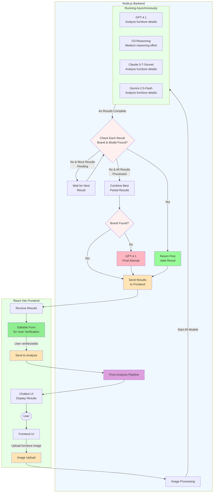
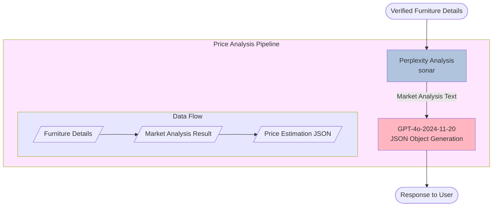

# kaluste-backend

⚠️ **WARNING: This documentation is outdated and corresponds to git TAG v1.0. The codebase has evolved significantly since this version. Only section [Vision Pipeline](#vision-pipeline) and text after it is up to date. Please refer to the latest code for other implementation details.**

Älyä-hankkeessa KalusteArvio-projektin palvelin ja tekoälyliittymät

## Table of Contents

- [Technologies](#technologies)
- [Installation](#installation)
- [Database](#database)

## Technologies

- TypeScript
- Node.js
- Express.js
- OpenAI API
- MongoDB
- Docker
- Memcached

## Installation

### Enviromental variables

Create an .env file in the root folder with the following values (use the .env.example file for reference)

## Database

This project uses [MongoDB](https://www.mongodb.com/) as its database solution and [mongoose](https://mongoosejs.com/) to interact with MongoDB.

### Main Functionalities

1. Conversation Logging

   - Stores chat interactions between users and AI
   - Endpoint: `/api/chat`
   - Records full conversation history

2. Review Logging
   - Stores user feedback and reviews
   - Endpoint: `/api/review`

### Database Schema

The schema for the database documents is declared in the [log.ts](/src/models/log.ts) file.

## Vision Pipeline

> **Note**: This section is up to date. _Last updated: May 6, 2025_

The Vision Pipeline process works as follows:

1. User uploads a furniture image through the Frontend UI
2. Image is processed and sent to multiple AI vision models in parallel:
   - GPT-4.1-2025-04-14
   - O3-Reasoning with medium reasoning effort
   - Claude-3-7-Sonnet-Latest
   - Gemini-2.5-Flash-Preview-04-17
3. As each model completes analysis:
   - If both brand and model are found, return that result immediately
   - If brand or model is missing but more results pending, wait for next result
   - If no complete results found and all results processed, combine best partial results
4. If brand is still missing after combining results, make final attempt with GPT-4.1 which has been specifically instructed to provide its best guess for the brand
5. Present results in editable form for user verification
6. After user verification, proceed to Price Analysis Pipeline



## Price Analysis Pipeline

The price analysis process uses Perplexity AI and GPT-4o to generate market-based price estimations for furniture. Here's how the price analysis pipeline works:

1. After furniture details are verified by the user, they are sent to Perplexity AI
2. Perplexity analyzes the furniture details and produces a market analysis
3. The market analysis is processed by GPT-4o, which generates a structured JSON response
4. The price estimation is returned directly to the user



## To Developer

### Environment Setup

Remember to set environment variables:

```bash
cp .env.example .env
```

### Rahti Production Environment

Application has been published to Rahti following [this deployment guide](https://github.com/laguagu/arvolaskuri-node-backend?tab=readme-ov-file#sovelluksen-julkaisu-csc-rahti-2ssa-github-integraatiolla).

## Lisenssi

License - katso [LICENSE](LICENSE) tiedosto lisätietoja varten.
